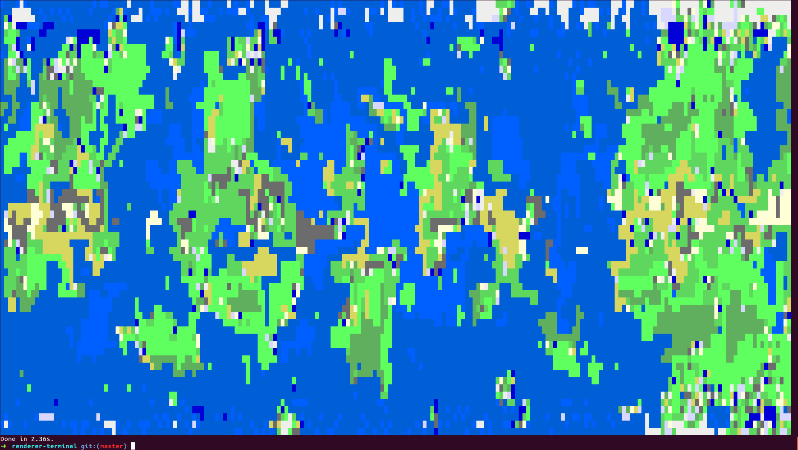

# @mapgen/mapgen

Generate a random pixel map.

## @mapgen/renderer-terminal

View in [terminal](packages/renderer-terminal):

## @mapgen/renderer-canvas

View in [canvas](packages/renderer-canvas):

